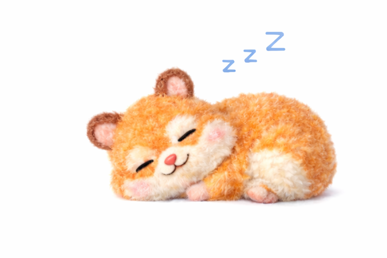

## 👋 Hi, I’m @YangHyeonBin

I'm a passionate junior programmer who enjoys building meaningful products with like-minded people.
I strive to create work I truly enjoy, and I’m motivated by the desire to make a positive impact in the world.

  

### 🌱 Current Role

Frontend engineer at a startup (since Jan 2023)

Enjoy working closely with my team, openly discussing ideas and searching for better solutions together.

### 🚀 Recent Work

Contributed to the relaunch of our SaaS product, now named “[Orblit](https://orblit.space)” (started since Jan 2025)

Migrated our tech stack from Flutter to React, and from Firebase (NoSQL) to Supabase (PostgreSQL-based)
→ This change allowed us to dramatically improve web performance by adopting a relational data structure that suits our growing product needs

Returning to React—a framework I first encountered while learning web development—has reignited my excitement for creating robust, modern web applications

### 👀 What Drives Me

I’m passionate about collaborative development that drives meaningful impact. I love how software can solve real-world problems and enhance daily life!

**📫 How to reach me**: idgusqls0506@gmail.com

### Some other activities...

<!--  -->

<!--  -->

<!---
YangHyeonBin/YangHyeonBin is a ✨ special ✨ repository because its `README.md` (this file) appears on your GitHub profile.
You can click the Preview link to take a look at your changes.
--->

<!-- ZOOROFILE_START -->
<!-- Auto-generated by Zoorofile 🐾 | Do not edit manually -->
<!-- Last updated: 2026-04-26T01:01:27.917Z -->

---

😴 휴식 중...

이번 주 1개의 레포지토리에 10개의 기여를 하고 있어요!

### 📅 이번 주 기여

**요약**

| | 레포 수 | 커밋 | PR | 이슈 |
|:---|:---:|:---:|:---:|:---:|
| 🔓 Public 레포 | 0개 | 0 | 0 | 0 |
| 🔒 Private 레포 | 1개 | 7 | 3 | 0 |

---

*🐾 Generated by [Zoorofile](https://github.com/YangHyeonBin/zoorofile) — Choose your git pet!*

<!-- ZOOROFILE_END -->

